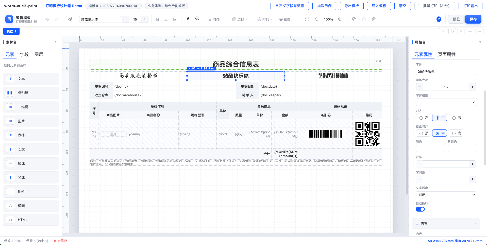

# worm-vue3-print

Vue 3 可视化打印模板设计器 + 模板表达式引擎 + 同构渲染管线的开源 monorepo（npm workspaces）。

可视化拖拽设计打印模板、数据绑定、表达式求值、分页排版；三端共用同一套渲染与分页算法（逻辑同源，像素级一致还需字体与 Chromium 内核同源）。
纯 Vue 3 + HTML/CSS/SVG 原生控件实现，不依赖任何 UI 组件库，可以接入任意 Vue 3 项目中。

> ⚠️ **实验性能力声明**：`packages/print-common`（`@worm-vue3-print/common`）与示例 `demo-common/` 属于**实验性质**，用于把设计器以零框架运行时形态（原生自定义元素）提供给 **Vue 3 / Vue 2 / React / jQuery 等多种运行时框架**（含无框架宿主）。该包**尚未完成稳定性测试**，只在工作区内构建，未发布到 npm，不建议用于生产；Vue 3 项目请使用成熟的 `@worm-vue3-print/canvas`。

## 🔗 在线预览

GitHub Pages：**https://worm-longliu.github.io/worm-vue3-print/**

> 静态部署，仅支持设计器编辑、浏览器预览与浏览器端打印；服务端 PDF 与桌面客户端静默打印不可用。

## 🖼 设计器预览



## 📖 文档

**[中文文档首页 · 文档总览](docs/中文/文档总览.md)** ｜ [快速开始](docs/中文/指南/快速开始.md) ｜ [API 文档](docs/中文/接口/API文档.md) ｜ [示例](docs/中文/示例/示例文档.md)

**English**: [Overview](docs/en/Overview.md) ｜ [Changelog](docs/en/CHANGELOG.en.md)（由 AI 依据中文文档生成，以中文版为准）

使用指南：

- [使用指南（核心概念与输出方式选型）](docs/中文/指南/使用指南.md)
- [模板设计器（PrintDesigner 接入）](docs/中文/指南/模板设计器.md)
- [表达式引擎（数据绑定与内置函数）](docs/中文/指南/表达式引擎.md)
- [渲染管线（浏览器预览 / 服务端 PDF）](docs/中文/指南/渲染管线.md)
- [三端渲染一致性方案](docs/中文/指南/三端渲染一致性方案.md)
- [静默打印（桌面客户端 + 浏览器 SDK）](docs/中文/指南/静默打印.md)
- [技术复盘（偏差原因与客户端选型）](docs/技术复盘.md)
- [CHANGELOG（版本变更记录）](docs/中文/CHANGELOG.md)


## 项目目录结构

```
worm-vue3-print/
├── packages/                  # 可发布的 npm 包（npm workspaces，发布到 npm）
│   ├── print-core/            # @worm-vue3-print/core   模板表达式引擎 + 同构渲染管线（含浏览器端静默打印 SDK 子路径 /client）
│   ├── print-canvas/          # @worm-vue3-print/canvas Vue 3 可视化设计器画布
│   ├── print-common/          # @worm-vue3-print/common 通用宿主适配版设计器（实验性 · 未完全稳定测试；支持多种运行时框架；生产请用 print-canvas）
├── clients/
│   └── print-client/          # @worm-vue3-print/print-client Electron 静默打印桌面客户端（private，不发布 npm）
├── services/
│   └── print-render/          # @worm-vue3-print/render 服务端 PDF / 截图渲染微服务（private，不发布 npm）
├── demo/                      # 演示项目：Vue 3 设计器 + 预览 + 静默打印集成的完整示例
├── demo-common/               # 演示项目（实验性 · 未完全稳定测试）：apps/ 下四个独立宿主 demo（Vue3/Vue2/React/jQuery），index.html 为静态导航页
├── docs/                      # 项目文档
│   ├── 中文/                  #   中文文档（指南 / 接口 / 示例 / 文档总览 / CHANGELOG）
│   ├── en/                    #   英文文档（首页 Overview / CHANGELOG，AI 生成并声明）
│   └── superpowers/           #   设计文档（specs）与实施计划（plans）
├── skills/                    # opencode 集成技能（worm-vue3-print-integration，含对接指南）
├── scripts/                   # 仓库级脚本（打印架构守卫、产物版权头注入）
├── .github/
│   ├── workflows/             # CI / 自动发布工作流
│   └── release/               # 发布配置
├── .opencode/                 # opencode 本地配置与插件
├── package.json               # npm workspaces 根清单：构建 / 测试 / 打包根命令
├── AGENTS.md                  # 对本仓库工作的 AI 代理约束（语言、分层边界、协作约定）
├── CONTRIBUTING.md            # 发布与协作流程
├── SECURITY.md                # 安全问题报告方式
├── LICENSE                    # MIT
└── README.md
```

各目录功能说明：

| 目录 / 文件 | 功能说明 |
|---|---|
| `packages/print-core` | 核心包（`@worm-vue3-print/core`）：表达式引擎（lexer / parser / evaluator）、`template-parser`、数据绑定 / 分页 / HTML 生成（`render`）、设计器内核与浏览器适配（`designer` / `browser`，含连续纸探针与 `browserCodeRenderer`）；浏览器端静默打印 SDK 位于子路径 `/client`（传输层 / 协议与错误码 / 打印门面）。纯 TypeScript，无 Vue、无宿主依赖 |
| `packages/print-canvas` | 设计器画布（`@worm-vue3-print/canvas`）：Vue 3 组件（`components`）、组合式函数（`composables`）、内置帮助内容（`help-content`）、原生控件样式（`styles`）。含 `PrintDesigner`、`PrintHtmlPreview` |
| `packages/print-common` | ⚠️ **实验性 · 未完全稳定测试**：通用宿主适配设计器（`@worm-vue3-print/common`）：以原生自定义元素 `<print-designer>` 形态提供，**支持多种运行时框架**——任意框架（Vue 3 / Vue 2 / React / jQuery / Angular 等）或无框架宿主均可直接接入，供 React / Vue2 / jQuery 等非 Vue3 宿主使用，**不打包 Vue 运行时**。样式与图标由 `scripts/gen-styles.mjs`、`scripts/gen-icons.mjs` 从 canvas 构建产物派生（类名逐字对齐），交互与渲染逻辑复用 core 的 designer 导出；另产出浏览器直挂形态 `dist/common.js`（UMD，core 与码制库内联，挂 `window.WormPrintCommon`）与 `dist/common.css`，无打包器宿主一个 `<script>` + 一个 `<link>` 即可接入。与 Vue3 版的功能与样式一致性说明见包内 `PARITY.md`，宿主示例在 `demo-common/apps/` |
| `clients/print-client` | 静默打印桌面客户端（Electron，private）：主进程 WS 服务 / 打印引擎 / 打印机服务 / 配置与任务记录（`src/main`）、配置窗口 Vue 3 界面（`src/renderer`）、隐藏渲染 worker（`src/worker`）、沙箱 IPC 桥（`src/preload`）、IPC 通道契约（`src/shared`）；含 electron-builder 打包配置与真机冒烟脚本（`scripts/`） |
| `services/print-render` | 服务端渲染微服务（private）：基于 Playwright 的 PDF / 截图渲染（`driver-playwright` / `pdf-render` / `browser-pool` / `server`），workspace 软链依赖 core，与浏览器预览、桌面客户端共用同一份打印管线 |
| `demo` | Vue 3 演示项目：设计器接入（`App.vue`）、静默打印集成、渲染客户端封装（`render-client.ts`）、业务字段（`business.ts`）、内置模板 JSON（`template-purchase-receipt.json`），端口 9303 |
| `demo-common` | ⚠️ **实验性示例 · 未完全稳定测试**（对应上方实验性的 `print-common`）：通用宿主适配、**支持多种运行时框架**的多宿主集成示例：`apps/vue3`（9331，SFC）、`apps/vue2`（9332，SFC + Options API）、`apps/react`（9335，hooks）走 **NPM 包接入**；`apps/jquery`（9334）走 **JS + CSS 直挂**（无打包器、业务代码不 import 插件，只用 `window.WormPrintCommon` + `$`）。四个工程彼此独立（各有 `package.json` / lock / node_modules），**不共用任何壳层封装**——设计器挂载、`fields`/`template` 的 property 注入、`uploadImage` 宿主回调、`save`/`preview`/`help`/`dblclick-element`/`dblclick-cell` 事件、浏览器渲染预览与打印、服务端 PDF、客户端静默打印、批量份数都写在各自的文件里，照抄一个工程即可落到自己项目；示例模板/字段/数据也各自带一份（`src/templates.js`）。四个页面的界面版式与 `demo/` **完全一致**：同一份顶栏动作、同一个全屏打印预览层、同一套「打印输出 / 加载示例 / 自定义字段与数据」弹窗，样式由 `scripts/sync-demo-styles.mjs`（`npm run styles:demo-common`）从 `demo/` 逐字抽取成各工程同 MD5 的 `src/styles/demo-ui.css`，工程内不再写私有布局样式。`index.html` 是四入口静态导航页，`scripts/dev-all.mjs` / `install-all.mjs` 一次拉起或安装四个工程，`scripts/verify-demo.mjs` 做 32 项 UI 级验收（按 demo 类名逐项判定，含防「DOM 全绿但布局塌陷」的尺寸断言） |
| `docs` | 文档：`中文/`（指南、接口、示例、文档总览、CHANGELOG，为权威版本）、`en/`（英文首页 Overview 与 CHANGELOG，由 AI 生成并在文内声明），`superpowers/` 为设计文档（specs）与实施计划（plans） |
| `skills` | opencode 集成技能 `worm-vue3-print-integration`：往宿主项目接入 core / canvas / 静默打印的规范与指南（`SKILL.md` + `references/`） |
| `scripts` | 仓库级 Node 脚本：`check-print-architecture.mjs`（三端重复实现守卫，`npm run lint:print-architecture`）、`inject-license-banner.mjs`（发布包类型声明补版权头） |
| `.github/workflows` | CI（构建 / 测试）与自动发布工作流 |
| `package.json` | 根清单：workspaces 聚合、构建 / 测试 / 打包根命令（`npm run pack:client` 等） |

## 包结构

| 包 | 目录 | 发布 | 说明 |
|----|------|------|------|
| `@worm-vue3-print/core` | `packages/print-core` | npm | 模板表达式引擎与同构渲染管线（数据绑定 / HTML 生成 / 分页，含连续纸探针推导），纯 TypeScript，无 Vue、无宿主依赖，浏览器与 Node 均可运行；浏览器端静默打印 SDK 经子路径 `@worm-vue3-print/core/client` 提供 |
| `@worm-vue3-print/canvas` | `packages/print-canvas` | npm | Vue 3 可视化设计器画布（原生控件，无 Element Plus；含 `PrintDesigner`、`PrintHtmlPreview` 组件） |
| `@worm-vue3-print/common` | `packages/print-common` | 未发布 · **实验性** | ⚠️ 通用宿主适配设计器 `<print-designer>`（零框架运行时，实现为原生 Custom Element + Shadow DOM）：**支持多种运行时框架**，功能与样式对齐 `@worm-vue3-print/canvas`，供 React / Vue2 / jQuery 等非 Vue3 宿主接入（详见包内 `PARITY.md`）。**尚在实验阶段、未完全稳定测试，不建议用于生产**；Vue 3 项目请继续使用 `@worm-vue3-print/canvas`（成熟方案） |
| `@worm-vue3-print/render` | `services/print-render` | 内部 | 基于 Playwright（Headless Chromium）的服务端 PDF / 截图渲染微服务，Docker 部署；与浏览器预览、桌面客户端共用同一份渲染管线，保证三端出纸一致 |
| `@worm-vue3-print/print-client` | `clients/print-client` | 内部 | 跨平台静默打印桌面客户端（Electron，回环 WebSocket + core 同构渲染 + `webContents.print` 静默出纸） |

> 发布到 npm 的只有 `core` 与 `canvas` 两个包（`npm run publish:npm`）；`render` 与 `print-client` 为私有工作区包，分别以 Docker 镜像和安装包形式分发。`print-common` 与其示例 `demo-common` 为**实验性**产物，用于支持 Vue 3 / Vue 2 / React / jQuery 等多种运行时框架，**尚未完成稳定性测试**，目前只在工作区内构建使用，不建议应用到生产中，是否上 npm 尚未决定；Vue 3 项目请使用 `@worm-vue3-print/canvas`。

## 功能特性

- 可视化画布：拖拽、吸附、对齐、参考线、标尺、图层面板、多选与组合、撤销/重做
- 元素丰富：文本、长文本、数据表格、条形码、二维码、图片、线条、形状、HTML、页码、水印
- 数据绑定：`{field.path}` 字段绑定、表达式求值（safelist 安全执行）、格式化函数
- 智能表格：动态分页、跨页重复表头、序号/小计/汇总、单元格合并
- 同构渲染：一套渲染逻辑同时产出浏览器预览、服务端 PDF 与桌面客户端出图（逻辑同源）
- 静默打印：跨平台桌面打印客户端（Electron）+ 浏览器端 SDK，本地 WebSocket 通讯、`webContents.print` 静默出纸，全程无打印对话框、不依赖浏览器插件，支持连续纸纸长自动推导
- 内置业务模板：采购收货单、批发销售单、出入库单、库存盘点单
- 毫米（mm）单位精确布局，支持 A4 等纸张规格

## 开发

```bash
npm install      # 在仓库根安装并链接各 workspace 包
npm run build    # 构建所有包
npm test         # 运行所有包测试
```

各模块开发启动（均在仓库根执行）：

| 命令 | 作用 |
|---|---|
| `npm run dev:demo` | 启动 demo（Vite，http://localhost:9303） |
| `npm run dev:demo-common:vue3` | 启动 Vue3 宿主 demo（Vite，http://localhost:9331）；`…:vue2` / `…:react` / `…:jquery` 同理，端口 9332 / 9335 / 9334 |
| `npm run dev:demo-common:all` | 一次起四个宿主 demo（先 `npm run install:demo-common:all` 逐个安装依赖） |
| `npm run styles:demo-common` | 从 `demo/` 重新生成四个宿主工程的 `src/styles/demo-ui.css`（版式必须与 demo 一致，产物勿手改） |
| `npm run dev:render` | 启动渲染微服务（tsx 直跑，http://localhost:3001） |
| `npm run dev:client` | 启动 Electron 桌面客户端（electron-vite dev） |
| `npm run dev:core` | core 以 watch 模式持续构建 dist（tsup） |
| `npm run dev:canvas` | canvas 以 watch 模式持续构建 dist（vite build --watch，不含 vue-tsc 类型检查） |

> demo 与 Electron 客户端消费 core / canvas / SDK 的构建产物（dist），改库代码后可用
> `dev:core`、`dev:canvas` 自动重编译；类型检查仍需执行完整 `npm run build`。

## 安装

```bash
# 安装核心包（模板表达式引擎 + 同构渲染管线）
npm install @worm-vue3-print/core

# 安装设计器画布（Vue 3 可视化设计器 + 预览组件）
npm install @worm-vue3-print/canvas
```

静默打印浏览器端 SDK 随 core 提供，无需单独安装，从 `@worm-vue3-print/core/client` 导入（需配合本机运行的桌面打印客户端）。

> core / canvas 当前版本：`1.3.5`。

## 更新

```bash
# 检查可用更新
npm outdated

# 更新到最新版本
npm update @worm-vue3-print/core @worm-vue3-print/canvas

# 或直接安装最新版
npm install @worm-vue3-print/core@latest @worm-vue3-print/canvas@latest
```

其他包管理器：
- yarn: `yarn upgrade @worm-vue3-print/core @worm-vue3-print/canvas`
- pnpm: `pnpm update @worm-vue3-print/core @worm-vue3-print/canvas`

## 快速使用

### `@worm-vue3-print/core`（模板表达式引擎 + 同构渲染管线）

```ts
import { bindData, paginate, generateHtml } from '@worm-vue3-print/core'

const bound = bindData(templateJson, printData)      // 数据绑定
const pages = paginate(bound, measured, options)     // 分页排版
const html = generateHtml(pages)                     // 生成 HTML
```

### `@worm-vue3-print/canvas`（Vue 3 可视化设计器）

以下接入配置与仓库 `demo/App.vue` 保持一致：

```ts
import { PrintDesigner, PrintHtmlPreview, createDefaultTemplate } from '@worm-vue3-print/canvas'
import type { PrintBusinessField, TemplateData } from '@worm-vue3-print/canvas'
// 设计器控件样式（发布包唯一对外样式入口），需全局引入一次
import '@worm-vue3-print/canvas/style.css'
```

```vue
<template>
  <PrintDesigner
    ref="designerRef"
    :initial-template="templateData"
    :fields="fields"
    :is-edit="true"
    :show-help="true"
    @preview="onPreview"
    @save="onSave"
  />

  <!-- 「加载默认布局」等业务入口由宿主自渲染，不在设计器工具栏内 -->
  <button type="button" @click="onLoadDefaultLayout">加载默认布局</button>

  <!-- 浏览器端免保存预览：直接使用当前画布 JSON + 业务数据 -->
  <Teleport to="body">
    <PrintHtmlPreview
      v-if="previewVisible"
      ref="htmlPreviewRef"
      :template-json="previewTemplateJson"
      :print-data="printData"
      @rendered="(n) => previewPages = n"
    />
  </Teleport>
</template>

<script setup lang="ts">
import { ref } from 'vue'

const templateData = ref<TemplateData>(/* 初始模板 TemplateData */)
const fields = ref<PrintBusinessField[]>(/* 业务字段 PrintBusinessField[] */)
const designerRef = ref<InstanceType<typeof PrintDesigner> | null>(null)
const previewTemplateJson = ref<Record<string, any> | null>(null)

function onPreview() {
  // 获取当前画布模板 JSON，供免保存预览
  const json = designerRef.value?.getTemplateJson?.()
  if (!json) return
  previewTemplateJson.value = json
}

function onSave(json: string) {
  // 宿主持久化模板 JSON
}

/**
 * 加载默认布局：宿主自实现的业务逻辑。示例用 createDefaultTemplate() 造空白默认模板，
 * 真实宿主可在此按业务类型拉取服务端默认模板；用新对象回写 templateData 引用即可重载画布
 */
function onLoadDefaultLayout() {
  if (!confirm('将覆盖当前画布内容，是否继续？')) return
  templateData.value = createDefaultTemplate()
}
</script>
```

关键 props / 事件 / 方法：

- `initial-template`：初始模板 `TemplateData`；`fields`：业务字段 `PrintBusinessField[]`；
  `is-edit`：是否编辑态。
- `show-help`：帮助入口开关，默认开启，传 `false` 可关闭帮助按钮与帮助弹框。
- `@preview` / `@save`：预览与保存事件，宿主持有 `getTemplateJson()`/`getTemplateJson` 之外的业务逻辑自理。
- `getTemplateJson()`：通过 `ref` 获取当前画布模板 JSON，用于预览 / 保存 / 截图。
- 模板加载 / 重置（如「加载默认布局」）属于宿主业务：把新的 `TemplateData` 赋给
  `initial-template` 即可重载画布并记录一次历史（撤销可回退），设计器工具栏不内置该入口。
- `PrintHtmlPreview`：同构预览组件，`template-json` 传画布模板 JSON，`print-data` 传业务数据，
  事件 `rendered` 回调预览页数，`ref.print()` 触发打印。

## 静默打印（桌面客户端）

跨平台（Windows / Linux / macOS）静默打印由两部分组成：

- **桌面打印客户端**（`clients/print-client`，Electron）：部署在业务工位电脑上，在隐藏窗口内复用 `core/browser` 同构渲染模板，
  再调用 `webContents.print({ silent: true })` 直接出纸——无系统打印对话框、不依赖浏览器插件。
- **浏览器端 SDK**（core 子路径 `@worm-vue3-print/core/client`，无需单独安装）：浏览器页面通过 WebSocket（默认从 `127.0.0.1:17521` 起端口探测，占用则 +1）
  连接本机运行的客户端，完成端口探测 / 自动重连 / 打印机枚举 / 静默打印。

### 安装并运行客户端

客户端是 monorepo 内的私有工作区包（不发布 npm），产物为绿色目录或安装包，需在工位电脑安装并运行：

```bash
# 在仓库根构建并产出安装包（macOS 可同时交叉打包 Windows）
npm run pack:client

# 绿色目录版（免安装，各平台只能在本平台构建自家产物）
npm run pack:client:dir
```

### 宿主侧接入（浏览器端 SDK）

```ts
import { PrintClient, WormPrintError } from '@worm-vue3-print/core/client'

const client = new PrintClient()
client.onStatusChange((s) => console.log('客户端状态：', s)) // 'disconnected' | 'connecting' | 'connected'

await client.connect()                        // 自动探测端口并握手；客户端未运行抛 CLIENT_NOT_RUNNING
const printers = await client.listPrinters()  // 枚举本机打印机

// 连续纸（CONTINUOUS）模板无需传纸高，客户端按渲染内容自动推导；长度单位均为微米（1mm = 1000μm）
const { jobId } = await client.print(templateJson, printData, {
  printerName: printers[0]?.name,
  copies: 1,
})

client.pair(token)                            // 安全配对：客户端开启「安全开关」后，用配置窗口展示的 token 配对一次
```

- 断线自动指数退避重连；失败抛 `WormPrintError`，按 `err.code` 分支处理（`PRINTER_NOT_FOUND`、`BUSY`、`PRINT_FAILED` 等）。
- SDK 完整接口见 [静默打印指南](docs/中文/指南/静默打印.md)；
  客户端原理、协议与打包见 [`clients/print-client/README.md`](clients/print-client/README.md)。

## 渲染服务

服务端渲染位于本仓库 monorepo 的 `services/print-render`（私有服务包，不发布 npm）：
基于 Playwright 提供服务端 PDF / 截图渲染微服务（`/render/pdf`、`/render/screenshot`），
通过 workspace 本地软链依赖 `core` 渲染管线，与浏览器预览、桌面客户端共用同一份实现；测量、连续纸探针、码制渲染与出图由 core 的 DOM 执行器在页面上下文执行。

```bash
# 本地开发（首次需 npx playwright install chromium，macOS 可直接使用系统 Chrome）
npm run dev:render

# Docker 构建（在仓库根执行）
docker build -f services/print-render/Dockerfile -t worm-vue3-print-render .
```

详见 [`services/print-render/README.md`](services/print-render/README.md)。

## 开源

- License：MIT（见 `LICENSE`）。
- 清晰的分层边界：`core`（纯逻辑）→ `canvas`（设计器 UI）。
- 发布与协作流程见 `CONTRIBUTING.md`。

## 依赖与开源协议（商用合规说明）

本项目采用 **MIT 协议**，商用、二次分发、闭源集成、修改后对外提供服务、二次销售均**无需授权申请、无需付费、无需开源你的业务代码**，唯一义务是保留本项目版权声明（`Copyright (c) 2026 Worm Base AI`）。

### 运行时依赖清单与协议

以下是会被打进发布产物或随服务分发的**运行时依赖**，逐一经审计：

| 依赖 | 协议 | 所在模块 | 用途 | 商用影响 |
| --- | --- | --- | --- | --- |
| `jsbarcode` | MIT | core / canvas | 一维条码渲染 | 无限制 |
| `qrcode` | MIT | core / canvas | 二维码渲染 | 无限制 |
| `dompurify` | MPL-2.0 **或** Apache-2.0（双许可，可选） | canvas | HTML 富文本 XSS 净化 | 无限制 |
| `sortablejs` | MIT | canvas | 图层/列表拖拽排序 | 无限制 |
| `lucide-vue-next` | ISC | canvas | 工具栏图标 | 无限制 |
| `express` | MIT | render 服务 | HTTP 接口层 | 无限制 |
| `playwright` | Apache-2.0 | render 服务 | Headless Chromium 输出 PDF/截图 | 无限制 |
| `ws` | MIT | 桌面客户端 | 本地 WebSocket 静默打印通道 | 无限制 |

### 审计结论

- **不含任何 GPL / AGPL / LGPL / SSPL / CPAL 等强 copyleft 协议**，不存在「因依赖传染而被迫开源你自有代码」的风险。
- 唯一的弱 copyleft 来源是 `dompurify` 的 MPL-2.0 分支。MPL 只约束该库自身的源文件，且它同时授予 Apache-2.0 选项——**按 Apache-2.0 使用即可，本项目按 Apache-2.0 口径处理**，无任何附加义务。
- 开发期依赖（Vite、TypeScript、Vitest、vue-tsc 等，含 Electron 构建链）为 MIT / Apache-2.0 / BSD-3-Clause，**不进入发布产物、不随你的应用分发**，不构成下游义务。
- `playwright` 下载的 Chromium 二进制为 BSD-style 许可，可自由用于商业用途（含售卖生成的 PDF）；如需随 Docker 镜像分发，保留其声明文件即可。
- 依赖树共 545 个包（含 dev）已逐包核对 `license` 字段，无缺失声明、无 `NONE`/`SEE LICENSE IN` 之类不透明条目。

### 你需要做什么

**什么都不用做。** 若你把本库作为依赖集成进产品，且产品需要列出第三方许可清单（OSS Notice），可直接引用上表；本项目自身的 `LICENSE` 文件建议随产物一并保留。

> 本说明基于对项目依赖的静态审计，随版本更新维护。协议原文以各依赖官方仓库与 `LICENSE` 文件为准；本文不构成法律意见，重大商业决策请咨询法务。

## 仓库地址

- Gitee：https://gitee.com/liulong_oschina/worm-vue3-print
- GitHub：https://github.com/worm-longliu/worm-vue3-print

## 抖音 & 赞赏

本项目基于 MIT 协议免费开源，赞赏纯属自愿、与授权和服务无关。

如果这套工具帮到了你，欢迎扫码请作者喝杯咖啡；赞赏后请在 [Issue](https://github.com/worm-longliu/worm-vue3-print/issues) 留言昵称，我会登记进 [赞赏名单](SPONSORS.md)（仅公开昵称与日期，金额私有不公示）。

<p align="center">
  
  &nbsp;&nbsp;&nbsp;&nbsp;
  
  &nbsp;&nbsp;&nbsp;&nbsp;
  
</p>
