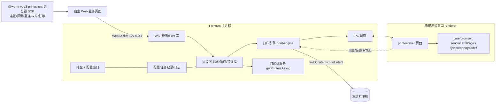

# 静默打印桌面客户端设计文档

- 日期：2026-09-12
- 状态：已评审（待最终确认）
- 范围：新增跨平台桌面打印客户端 `clients/print-client` 与浏览器端集成 SDK 包

## 1. 背景与目标

worm-vue3-print 现有能力：

- `@worm-vue3-print/core`：模板表达式引擎、同构渲染管线（纯 TypeScript）；
- `@worm-vue3-print/canvas`：Vue 3 可视化设计器画布；
- `services/print-render`：基于 Playwright(Headless Chromium) 的 PDF/截图渲染微服务（Docker 部署）。

现有链路只完成「渲染」，缺少把渲染结果送到物理打印机、无弹框静默出纸的最后一公里。

**目标**：提供一个安装在业务工位电脑上的桌面客户端，支持 Windows / Linux / macOS，接收宿主 Web 业务系统下发的打印任务，本地完成模板渲染并静默打印到指定打印机，全程不弹系统打印对话框。

**非目标（本期不做）**：

- 云端集中下发、WebSocket 外连业务服务器的拓扑；
- 客户端本地任务队列、离线缓存、失败自动补打；
- 安装包自动更新、代码签名；
- 打印任务 webhook 回调。

## 2. 需求结论

| 项 | 结论 |
|---|---|
| 客户端形态 | Electron 桌面应用，系统托盘 + 配置窗口，支持 Win/Linux/Mac |
| 渲染方式 | 客户端本地渲染，复用 core 同构管线，断网可打（模板引用的在线图片 URL 除外） |
| 通信通道 | 客户端在本机监听 `ws://127.0.0.1:<端口>`，浏览器页面直连；不提供 HTTP |
| 打印配置 | 宿主端维护「模板 → 打印机/纸张/份数等」映射并缓存于浏览器本地，打印时随任务下发；客户端提供打印机枚举接口 |
| 可靠性 | 不做本地队列；客户端单任务串行处理，并发任务返回 `BUSY`，由宿主决定重发 |
| 结果反馈 | WebSocket 请求/响应同步返回成功或失败错误码 |
| 界面 | 托盘菜单 + 配置窗口（端口、开机自启、日志级别、安全开关）+ 任务记录查看 + 日志查看 + 测试打印 |
| 安全基线 | 默认仅绑定 127.0.0.1；**提供默认关闭的可选安全开关**（Origin 白名单 + 配对 token），需要时开启 |
| 分发 | 先交付绿色目录版可运行产物；NSIS/dmg/AppImage/deb 安装包与自动更新后续再做 |
| 交付物 | `clients/print-client`（Electron 应用，private）+ 浏览器端 SDK 新包 `@worm-vue3-print/client` |
| 打印场景 | A4/A5 办公打印、58/80mm 热敏小票、不干胶标签、针式多联单据 |
| 资源加载 | 不强制离线：模板中允许引用业务服务器图片 URL，可联网加载 |

## 3. 方案选型

### 3.1 渲染与出纸技术路线

| 方案 | 安装包体积 | 结论 |
|---|---|---|
| Electron：自带 Chromium 本地渲染 + `webContents.print` 原生静默打印 | 约 80–120MB | **选用**。渲染与静默打印同一内核，原生支持指定打印机/份数/自定义纸张/方向/边距，三平台均走系统打印栈（Win GDI、Mac Print Framework、Linux CUPS），不挑客户机环境 |
| 服务端渲染 PDF + 瘦客户端（SumatraPDF / lp） | 20–40MB | 否决：依赖网络与 print-render 可用性，断网不可打印 |
| Tauri（系统 WebView） | 5–15MB | 否决：Linux 依赖 webkit2gtk，老旧 Windows 需另装 WebView2，静默打印需调系统命令，一致性差 |
| Playwright 自带 Chromium | +约 170MB | 否决：体积大且 Playwright 不提供静默打印能力 |

出纸方式选定 Electron 隐藏渲染窗口 + `webContents.print({ silent: true, printerName })`，不经过 PDF 中转。

### 3.2 通信拓扑

客户端在本机启动 WebSocket 服务，仅绑定回环地址；宿主页面经 SDK 直连。不采用客户端外连云端的拓扑（SaaS 多门店集中下发为未来场景，目录命名 `clients/` 为其预留位置）。

## 4. 架构设计



### 4.1 模块划分（主进程，每个模块单一职责）

- `ws-server`：WebSocket 服务生命周期，绑定 127.0.0.1，端口选择与连接管理，安全校验入口；
- `protocol`：消息编解码、类型与错误码（类型定义来自 SDK 包，保证两端一致）；
- `print-engine`：打印任务编排：校验 → 渲染 → 设置纸张 → `webContents.print` → 回调响应；单任务串行锁；
- `printer-service`：封装 `webContents.getPrintersAsync()`，统一打印机数据结构；
- `renderer-pool`：隐藏渲染窗口的创建/复用/销毁（固定一个 worker 窗口，异常时重建）；
- `config`：配置文件读写（端口、开机自启、日志级别、安全开关与白名单/token）；
- `job-history`：任务记录持久化（JSONL，环形上限，如最近 500 条），供配置窗口查看；
- `logger`：分级日志，写文件 + 推送配置窗口；
- `tray` / `main-window`：托盘与配置窗口。

### 4.2 仓库结构

- `clients/print-client/`（workspace，private）
  - `src/main/`：上述主进程模块
  - `src/preload/`：配置窗口 preload
  - `src/renderer/`：配置窗口（Vue 3，原生控件，不引入 UI 组件库，风格对齐 print-canvas）
  - `src/worker/`：隐藏打印 worker 页面（承载 core 渲染与测量；运行在 sandbox + contextIsolation，经专用 preload `src/preload/worker-preload.ts` 暴露的 `window.wormRender` IPC 桥通信，不开启 nodeIntegration）
  - 打包配置（electron-vite 或等价 Vite 方案，实现阶段确定并写明理由）
- `packages/print-client-sdk/`：发布名 `@worm-vue3-print/client`
  - 框架无关纯 TypeScript，无 Vue 依赖
  - **协议消息类型、错误码在本包定义**，客户端通过 workspace 依赖 import 类型，两端协议永不漂移

### 4.3 渲染复用

直接复用 core 的浏览器侧管线 `@worm-vue3-print/core/browser`（`renderHtmlPages`，内部封装 bindData → 测量 iframe → paginate → generateHtml 两遍渲染），无需从 print-render 迁移 Playwright 逻辑：

1. worker 主世界页面 import `renderHtmlPages(template, data, baseUrl, browserCodeRenderer, options?)`；
2. 该函数内部完成测量与分页，返回最终 HTML、页数，以及最终纸张尺寸 `paperMm` 与 `continuous` 标志（连续纸在 core 内部用测量 Map 做几何推导，见 6.2）；
3. 最终 HTML 经 `wormprint://` 内存协议载入打印窗口；
4. 出纸：对承载最终 HTML 的 webContents 调 `webContents.print`。

条码/二维码：使用 core/browser 自带的 `browserCodeRenderer`（jsbarcode + qrcode），客户端不直接依赖 bwip-js。

单任务渲染超时 30s，超时返回 `RENDER_TIMEOUT`，并重建 worker 窗口防止污染后续任务。

## 5. WebSocket 协议

### 5.1 帧格式

请求：

```json
{ "id": "消息唯一 ID", "type": "消息类型", "payload": {} }
```

成功响应：`{ "id": "...", "ok": true, "payload": {} }`

失败响应：`{ "id": "...", "ok": false, "error": { "code": "错误码", "message": "可读信息" } }`

单向通知（服务端 → 页面，本期仅预留，不产生业务消息）：`{ "id": null, "event": "..." }`

### 5.2 消息列表

| 方向 | type | payload（请求） | payload（响应） |
|---|---|---|---|
| → | `hello` | `{}` | `{ app: "worm-print-client", version, port }` |
| → | `printers.list` | `{}` | `{ printers: [{ name, isDefault, status }] }` |
| → | `print.submit` | 见 5.3 | `{ jobId }`（打印回调成功后才响应） |

非法 JSON、未知 type、payload 校验失败均返回对应错误响应。

### 5.3 print.submit

```ts
interface PrintSubmitPayload {
  templateJson: PrintTemplateData      // core 模板
  printData: Record<string, unknown>   // 业务数据
  baseUrl?: string                     // 图片等相对资源解析基址
  print: {
    printerName?: string               // 缺省走系统默认打印机
    copies?: number                    // 默认 1
    paperName?: string                 // 优先走打印机已配置纸型
    paperSize?: { width?: number; height?: number } // 单位微米；均可选，缺省取模板纸张；连续纸仅在覆盖时传
    landscape?: boolean
    margins?: { top: number; bottom: number; left: number; right: number } // 微米
    color?: boolean
    pageRanges?: Array<{ from: number; to: number }>
  }
}
```

参数映射到 `webContents.print` 的 `silent / printerName / copies / pageSize / landscape / margins / color / pageRanges`。`printerName` 在枚举列表中不存在时返回 `PRINTER_NOT_FOUND`。

### 5.4 错误码

| code | 触发条件 |
|---|---|
| `INVALID_REQUEST` | JSON 非法、字段缺失或类型错误 |
| `UNAUTHORIZED` | 安全开关开启后 token 错误或 Origin 不在白名单 |
| `PRINTER_NOT_FOUND` | 指定打印机在本机不存在 |
| `PRINTER_OFFLINE` | 打印机脱机/不可用（系统回调可区分时） |
| `BUSY` | 已有任务正在打印，并发请求被拒绝 |
| `RENDER_TIMEOUT` | 两遍渲染超过 30s |
| `PRINT_FAILED` | `webContents.print` 回调失败 |
| `INTERNAL` | 其他未预期异常 |

## 6. 关键策略

### 6.1 端口发现

- 默认端口 `17521`；启动时若被占用则自动 +1 重试（上限 +20）；
- 配置窗口实时显示实际监听端口；
- SDK `connect()` 从默认端口起逐端口连接并发送 `hello`，握手成功即定位客户端，全部失败则判定客户端未运行并抛出可识别错误；
- 后续如需固定端口冲突排查，配置窗口支持手动指定端口。

### 6.2 纸长策略（连续纸）

连续纸是**模板级页面属性**：core `PaperSize` 新增 `'CONTINUOUS'`，设计器页面属性可选「连续纸」——设计高度固定 297mm（仅画布/预览用），纸宽取 `customWidth`（默认 80mm，可改 58/76 等），强制纵向，底边距即末尾走纸留白，复用模板既有 `margins.bottom`（切到连续纸时默认 0，可改）。连续纸模板分页引擎恒定单页、CSS 不强制最小纸高。

出纸采用**测量高度推导 + 配置覆盖**：

1. 仅当模板 `paperSize === 'CONTINUOUS'` 时启用推导；普通纸始终使用模板纸张（`print.paperSize` 显式传入时可覆盖）；
2. `print.paperSize.height` 显式正整数时（宿主打印配置逃生门），直接使用；
3. 未传时，由 **core 在两遍渲染中**做**浏览器布局探针**：`paginate` 得到连续纸恒单页布局（含 flow-group）后，先用设计高度 297 生成一次最终 HTML 载入离屏 iframe，遍历 `.content-area` 全部后代取 `getBoundingClientRect().bottom` 相对纸顶的最大值（mm），再加 `footer 高 + 底边距`，最小钳制 25.4mm（1 英寸）。**不读 `scrollHeight`、也不用「元素设计 top + 实测高」包络公式**——前者因测量 iframe 固定 297mm 高且元素绝对定位而失效；后者对「动态表格 + 表下跟随元素（合计/签名）」会少算表格超高部分导致走纸裁切（p4），因为跟随元素在 flow-group 内被重定位到表格**实际**渲染底之后。探针由真实引擎布局，天然覆盖 flow-group/动态表格/小计汇总/重叠。推导后的显式高度再用于重新生成最终 HTML，使 `@page`、`.print-page`、footer 定位与出纸 `pageSize.height` 四者同源；宽度取 `print.paperSize.width` 或模板纸宽；
4. core 的 `renderHtmlPages` 直接回传 `paperMm`（最终纸尺寸）与 `continuous` 标志，客户端据此换算微米出纸，与宿主是否传 paperSize 无关；
5. 推导结果（含纸长来源 config/derived）在任务记录中记录实际下发的纸宽纸高，便于排查；
6. 实现阶段须在真机连续纸打印机（58/80mm）上验证推导精度（末尾留白、走纸长度公差，即 p4 问题），若系统驱动对自定义纸高有最小步进/舍入，以实测为准并在客户端文档中写明；不满足时宿主显式传 height 覆盖。

### 6.3 安全开关（默认关闭，可选开启）

默认状态：仅绑定 127.0.0.1，无 Origin/token 校验，开箱即用。

在配置窗口提供安全开关，开启后同时生效：

1. **Origin 白名单**：仅接受已配置域名来源的 WebSocket 连接（拒绝浏览器中任意其他网页的连接）；
2. **配对 token**：客户端首次开启时生成随机 token，在配置窗口展示；宿主页面经 SDK 完成一次配对（用户手工粘贴，或后续提供 `wormprint://pair?token=...` 深度链接），token 存入浏览器 localStorage；之后建立 WebSocket 连接时通过 URL 查询参数 `?token=...` 携带（握手前校验，失败直接关闭连接并返回 `UNAUTHORIZED`）。

说明残余风险：仅绑定回环可挡住所有远程网页，但浏览器中的任意本地网页仍可尝试连接本机端口发起打印；对多租户电脑、不可信网页环境建议开启此开关。协议与 SDK 在首版即包含鉴权字段位，开关关闭时忽略。

### 6.4 任务记录与日志

- 任务记录字段：时间、jobId、模板名、打印机、份数、纸张（含纸长来源：配置/推导）、结果、失败错误码与信息；JSONL 环形保留最近 500 条；
- 日志分级（debug/info/warn/error），默认 info；渲染与系统打印回调异常记 error 堆栈；
- 配置窗口提供「测试打印」按钮（内置最小模板走完整链路到指定打印机）。

### 6.5 开机自启与单实例

- 单实例锁（`app.requestSingleInstanceLock()`）；
- 开机自启通过 `app.setLoginItemSettings`，配置窗口开关控制；
- 关闭窗口不退出进程，驻留托盘；托盘菜单提供「显示窗口 / 测试打印 / 退出」。

## 7. SDK 设计（`@worm-vue3-print/client`）

```ts
const client = new PrintClient()
await client.connect()          // 端口探测 + 握手，内置指数退避自动重连
client.status                   // 'connecting' | 'connected' | 'disconnected'
client.onStatusChange(cb)
const { printers } = await client.listPrinters()
await client.print(templateJson, printData, { printerName, copies, /* ... */ })
```

- 框架无关纯 TS，浏览器环境使用，内置消息 id 生成、超时（默认可配）、错误还原为带 code 的 Error 子类；
- 安全开关开启时提供 `pair(token)` 方法与 token 持久化；
- 提供类型声明与最小使用文档（README）。

## 8. 测试策略

- **SDK 包（vitest）**：mock WebSocket 覆盖协议往返、端口逐探测定界、自动重连、超时、错误码透传、配对 token 注入；
- **客户端纯逻辑（vitest）**：协议编解码、配置读写、任务记录环形裁剪、`BUSY` 串行锁、纸长推导（测量高度 → 微米换算与配置覆盖优先级）、Origin 白名单校验；
- **渲染回归**：分页/条码/数据绑定依赖 core 与 print-render 既有测试，不重复建设；
- **真机手工清单（三平台）**：枚举打印机 → 测试页 → A4 多页 → 指定打印机/份数 → 热敏自定义纸长 → 脱机与缺纸报错。macOS 由开发侧验证，Windows/Linux 由使用方协助验证并记录结果。

## 9. 已知边界与风险

1. macOS 绿色版无签名：首次打开需右键允许，后续出签名安装包解决；
2. Linux 打印依赖系统 CUPS（主流桌面版默认自带）；无桌面环境的精简系统不在本期支持范围；
3. 针式打印机自定义纸张/多联走纸依赖驱动纸型支持，优先使用 `paperName` 选择驱动内纸型；
4. WebView/Chromium 渲染字体依赖客户机已装字体，模板使用的字体需业务侧确保客户机安装（未来可考虑字体随任务下发，本期不做）；
5. 在线图片 URL 在断网时无法加载，表现为缺图，不阻断打印（与 print-render 当前行为一致）；
6. 单任务串行：高并发工位由宿主端排队，客户端不承担队列职责。

## 10. 实施顺序概览（详细计划由 writing-plans 阶段产出）

1. SDK 包骨架：协议类型/错误码 + WS 传输 + 端口探测 + 单测；
2. Electron 工程骨架：托盘、配置窗口、单实例、配置读写；
3. 主进程 WS 服务 + 协议层，打通 `hello` / `printers.list`；
4. core/设计器连续纸页面属性（CONTINUOUS：默认 80×297、强制纵向、底边距）+ 沙箱 worker（preload）接入 core/browser 两遍渲染；
5. `webContents.print` 静默出纸与 `print.submit` 全链路（含纸长推导、BUSY、超时）；
6. 任务记录、日志、测试打印、安全开关；
7. 绿色目录打包（三平台）与真机清单验证；
8. README 与宿主集成文档。
